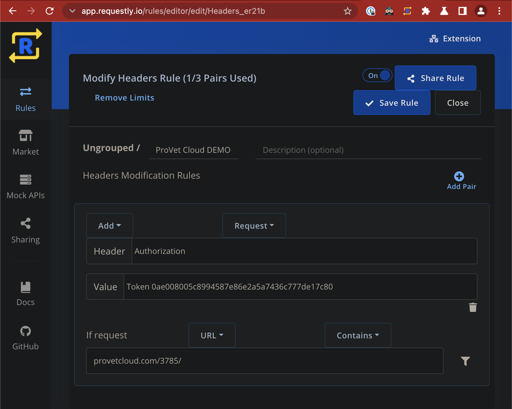

# PROVET Cloud REST API Docs

[Official PROVET Cloud REST API Documentation](https://support.provet.cloud/hc/en-gb/articles/360010249038)

## How to Configure API Browser Exploration

1. Install [Requestly](https://requestly.io/).
2. Configure a "Modify Headers Rule": 
3. Navigate to API Endpoint URL in browser: 
4. Use the "Options" button to establish what types of requests the endpoint supports: .
5. Use the "Filterable fields" and "Nested endpoints" dropdowns to determine what kind of filters and nested endpoints exist: .
6. Leverage the "HTML form" at the bottom of the page to submit test requests to the endpoint: .

## Unofficial PROVET Cloud REST API & Webhook Documentation

### Custom Fields API

[PROVET Cloud Custom Support Portal Reference](https://support.provet.cloud/hc/en-gb/requests/28497?page=1)

#### Custom fields in the UI

* Custom fields can be found in Settings -> Items & Lists -> Custom fields
* This section is under a block, which needs to be activated by a Provet Cloud admin
* Under this section, you can add, edit and delete custom fields
  * 

#### Custom fields in the API

* After setting the custom field to a record (for example client), you will see the fields set for each record in the API. A field called “fields_rel” should be possible to find under clients and patients, whether a custom field is used for them. (Picture below, a GET request in the API)
  * 
* Custom field values can have GET and POST request through the API, but they cannot be deleted through the API. See the example below of a JSON payload for the endpoint “custom_field_values/”.
  * 
* In the endpoint “custom_field_values/” the fields require the following fields to be filled:
  * “field” receives the ID of the custom field
  * “value” receives the string value for the field
  * "object_id” receives the ID of the object, for example, client/patient ID. Depending on the custom field, whether it is set for clients or patients."
  